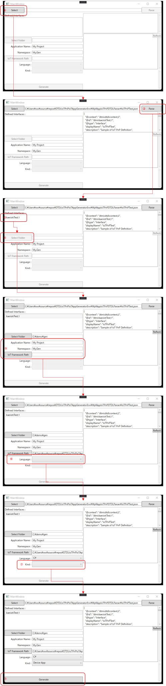

# サンプルジェネレータの使い方  
本リポジトリを Windows PC 上で clone する。
Visual Studio で、[Kae.IoT.Tools.IoTAppGenerator](./Kae.IoT.Tools.IoTAppGenerator) の C＃ Project File を開く。  

※ このプロジェクトは、フォルダー選択で、[Windows API CodePack](https://www.nuget.org/packages/WindowsAPICodePack-Shell/)を利用している。最新の .NET Core 環境では、NuGet ではうまくインストールできないので、一旦、NuGet でパッケージのインストールを行い、その後、依存関係から WindowsAPICodePack-Shell と WindowsAPICodePack-core の DLL ファイルを削除し、更に、プロジェクトの依存関係→アセンブリに、C:\Users\<i>各自のユーザーディレクトリ</i>\.nuget\packages の下にインストールされている DLL ファイルを追加する事。  

Kae.IoT.Tools.IoTAppGenerator を、ビルド＆実行する。  
以下の順序に従って、操作を行う。  

1. <b>Select</b> をクリックし、IoT Plug & Play を定義した DTDL ファイルを選択する。
1. DTDL ファイルの中身が読み込まれ表示されたら、<b>Parse</b> をクリックする。クリック前に、DTDL の定義を編集することも可能。
1. <b>Defined Interfaces</b>> に DTDL ファイルで定義されている Interface がリスト表示されるので、アプリコードを生成したい Interface を選択する。
1. <b>Select Folder</b> をクリックし、アプリコードを生成するフォルダーを選択する。
1. <b>Application Name<b>(プロジェクト名として使われる)と、<b>Namespace</b>(生成されるアプリコードの名前空間として使われる)を入力し、生成したいプログラミング言語を選択する。
1. 選択したプログラミング言語毎に、選択可能な実行タイプがある場合、下のコンボボックスに選択肢が表示されるので、生成したい実行タイプを選択する。
1. <b>Generate</b> をクリックすると、設定に従って、指定したフォルダーにアプリコード一式が生成される。右側の DTDL ファイルの中身の表示の下に、生成された、ディレクトリ、ファイル群が表示される。

## C# を選択した場合  
生成されたコードをビルドするには、https://github.com/kae-made/azure-iot-hub-device-app-framework で公開されている、Kae.IoT.Framework が必要である。このリポジトリを clone し、生成されたプロジェクトファイルに記述されている、プロジェクト参照のパスを更新する。  
IoT Edge Module の場合は、Kae.IoT.Framework をビルドして出来上がった DLL ファイル（Kae.IoT.Framework.dllとKae.Utility.Logging.dll）をプロジェクトファイルと同じディレクトリにコピーする  

※ この手作業は、自動化可能なので、将来的には自動化する。 2022/5/4時点

